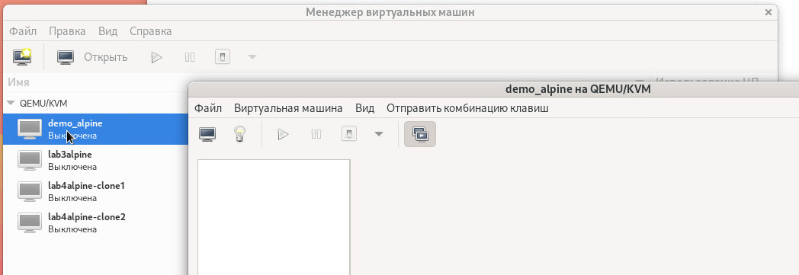
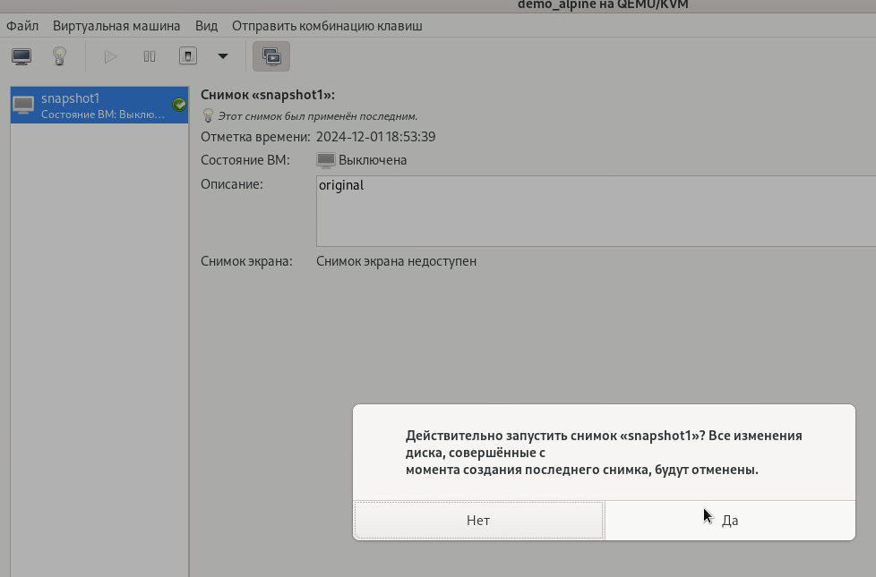
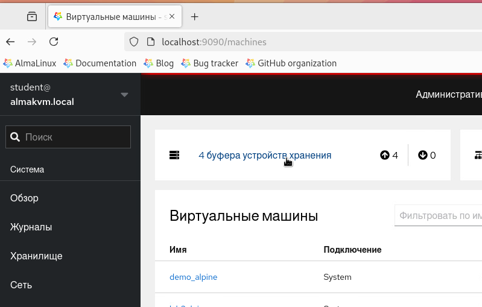

## 1. Подготовка хоста для работы в качестве гипервизора.

Здесь и далее будем называть:
- хост: виртуальная машина, на которой будет работать kvm (запущена на пользовательском сервере как виртуальная машина в VirtualBox/esxi/Microsft Hyper-v)
- ВМ: виртуальная машина, работающая внутри учебного хоста

### 1.1. Практическая работа

1. Подключитесь по ssh или к терминалу хоста. Установите необходимые пакеты.
```bash
sudo dnf groupinstall "Server with GUI" -y
```
На вопрос о ключе ответить утвердительно:
``` bash
Источник:  /etc/pki/rpm-gpg/RPM-GPG-KEY-AlmaLinux-9
Продолжить? [д/Н]: y
```
```bash
sudo dnf install epel-release
sudo dnf install neovim git tmux mc curl ripgrep gcc -y
```
2. По желанию добавьте конфигрурацию tmux
```bash   
tee ~/.tmux.conf << _EOF_
set -g mouse on
set -g status-style bg=black
set -g window-status-current-style bg=yellow,fg=black,bold
set -g status-right '#(curl -s wttr.in/Hamburg:Москва:Челябинск:Иркутск:Владивосток\?format\="%%l:+%%c%%20%%t%%60%%w&period=20") ...'
#set -g status-right '#(curl "wttr.in/?format=3") '
set -g default-terminal "tmux-256color"

set -g status-interval 10
set -g status-left-length 30
set -g status-left '#[fg=green]#(cut -d " " -f 1-3 /proc/loadavg)#[default] #[fg=cyan]%H:%M#[default] '
_EOF_
```
3. Включите Cockpit и настройте загрузку grphical.target
```bash
sudo systemctl enable --now cockpit.socket
sudo systemctl set-default graphical.target
```

4. Добавьте еще один диск 64G к хосту лабораторного стенда.

5. Перезагрузите хост.

6. Подключитесь к графической сессии хоста и скачайте образы iso дистрибуьтивов linux для будущих ВМ. 
Например:
- https://alpinelinux.org/downloads/ 
- https://yum.oracle.com/oracle-linux-isos.html
- https://sourceforge.net/projects/archbang/
  
```bash
wget https://dl-cdn.alpinelinux.org/alpine/v3.20/releases/x86_64/alpine-standard-3.20.3-x86_64.iso
wget https://yum.oracle.com/ISOS/OracleLinux/OL9/u5/x86_64/OracleLinux-R9-U5-x86_64-boot-uek.iso
```

7. Установите необходимое ПО для работы с виртуальными машинами на хосте. Проверьте валидность хоста для работы с виртуализацией. Добавьте модули для Cockpit.
```bash
dnf install -y virt-install virt-viewer virt-manager
virt-host-validate
systemctl enable --now libvirtd.service
dnf install cockpit cockpit-machines -y
virt-host-validate
```

8. Добавьте основного пользователя в дополнительные группы для работы с libvirt.
```bash   
sudo usermod -aG libvirtdbus,libvirt,qemu,kvm student
```

9. Сделайте для удобства символические ссылки:


10.  Перезагрузите хост и сделайте снимок Snapshot_pr1_1


## 2. Virt-manager. Создание хранилища.    
### 2.1. Практическая работа. Создание хранилища. 

> выполняется на хосте almakvm

1. Запустите в графической сессии терминал и в нем запустите комманду
```bash
virt-manager
```
2. Создайте пулы:
- выберите QEMU/KVM

- выберите "Пространство данных", затем "добавить пул" - "плюс" слева внизу окна. Название: demopool

- выберите "Пространство данных", затем "добавить пул" - "плюс" слева внизу окна. Название demoiso


3. Переключитесь в терминал и создайте новую volume group


4. Добавьте третье пространство demo_vmdata (Используйте тип пула: logical)


5. Скопируйте iso и qcow


6. Убедитесь, что диски добавлены


7. Выберите demo_vmdata в списке пулов


8. Создайте диск demovol объемом 6Gb.

9. Убедитесь в консоли, что диск существует.

10. Создайте в консоли еще один диск demovol2 объемом 4Gb (из командной строки создав lvm).

11. Обновите список дисков в virt-manager и убедитесь, что диск появился.

12. Вернитесь к ранее созданному snapshot_pr1_1 для хоста.

### 2.2. Лабораторная работа. Создание хранилища.
1. Cоздайте группу томов vgvmpool, состоящую из диска /dev/sdb (64G).
2. Добавьте новый pool с именем "iso" связанным с каталогом `/var/lib/libvirt/images/iso`
3. Добавьте новый pool с именем "vmpool_dir" связанным с каталогом `/var/lib/libvirt/images/vmpool_dir`
4. Скопируйте файлы iso-образов в pool "iso"
5. Скопируйте файл qcow-образа в pool "vmpool_dir"
6. Создайте новый logical-pool с именем "vmpool_vg", группу томов укажите ранее созданную vgvmpool.
7. Создайте в пуле "vmpool_vg" два диска "vol8gb" и "vol2gb" объемом 8 и 2 Gb соответственно. Воспользуйтесь графическим и консольным способом.
8. Сохраните состояние рабочего стенда, сделав snapshot_lab22.

## 3. Virt-manager. Создание сетей.
### 3.1. Практическая работа. Создание сетей. 
1. Запустите в графической сессси терминал и в нем запустите команду
```bash
virt-manager
```
2. Переключитесь в "Виртуальные сети"

3. Нажмите "+" и создайте сеть demonat1, настройте ipv4 dhcp как в примере ниже


4. Нажмите "+" и создайте сеть demorouted1, настройте ipv4 dhcp как в примере ниже


5. Нажмите "+" и создайте сеть demoisolated1, настройте ipv4 dhcp как в примере ниже


6. Просмотрите информацию о сетевых интерфейсах в консоли.


7. Вернитесь к ранее созданному snapshot_lab22 для хоста.

## 3.2. Лабораторная работа. Создание сетей.

1. Создайте сеть lab2nat1 со следующими параметрами:
- режим: NAT
- сеть IPv4 192.168.101.0/24
- DHCPv4 диапазон 192.168.101.100-150

2. Создайте сеть lab2routed1 со следующими параметрами:
- режим: Маршрутизируемая
- сеть IPv4 172.16.101.0/24
- DHCPv4 диапазон 172.16.101.100-150

3. Создайте сеть lab2isolated1 со следующими параметрами:
- режим: Изолированая
- сеть IPv4 10.10.101.0/24
- DHCPv4 диапазон 10.10.101.100-150

4. Проверьте в консоли, что адреса на виртуальные бриджи назначены из настроеных сетей.

5. Сохраните состояние рабочего стенда сделав snapshot_lab32.

## 4. Virt-manager. Создание ВМ.
### 4.1. Практическая работа. Создание ВМ.
1. Запустите в графической сессии терминал и в нем запустите команду
```bash
virt-manager
```
2. Нажмите "Создать виртуальную машину"

3. Выберите "Установка вручную"

4. На втором шаге выберите alpine

5. На третьем шаге оставьте значения по умолчанию или укажите свои значения памяти процессора

6. На  четвёртом шаге создайте диск размером 2 ГБ: 
- Выберите "Выбрать или создать дополнительное пространство данных" и "настроить"

- в окне "Расположения и создания томов в хранилище" укажите vmpool_dir , затем нажмите "+" для создания тома

- в окне "Добавление тома" добавьте том размером 2 ГБ, нажмите "Готово"

- в окне "Расположения и создания томов в хранилище" выберите вновь созданный том и нажмите "Сhoose volume"

- нажмите "Forward"

7. На пятом шаге 
- измените название виртуальной машины на demo_alpine, 
- поставьте "галочку" напротив "Проверить конфигурацию перед установкой", 
- откройте "Выбор сети" и выберите сеть lab2_nat1 и затем нажмите "Готово"


7. В окне настройки машины выберите "Добавить оборудование"

- Выберите первое значение хранилища и затем тип устройства укажите cdrom

- нажмите кнопку настроить, затем выберите pool iso 

- выберите диск alpine...
- Нажмите Готово добавление оборудования

8. В окне настройки виртуальной машины выберите "Параметры загрузки", поставьте галочку напротив сата CDROM и поднимите его вверх в приоритет загрузки


9. Нажмите "apply" и затем "Начать установку"

10. При установке ОС следуйте следующим рекомендациям:
- root
- setup-alpine

- настройка сети все по умолчанию; убедитесь, что адрес получили по dhcp

- выполните все шаги по установке операционной системы и выключите машину

- отключите в настройках виртуальной машины CDRom и включите машину


11. Перключитесь в терминал хоста и подключитесь по ssh к своей виртуальной машине (ip можно увидеть на экране виртуальной машины)


12. Создайте новую виртуальную машину

13. Выберите "Установка вручную"
14. На втором шаге укажите alpine

15. На третьем шаге оставьте значения по умолчанию или укажите свои значения памяти процессора

16. На  четвёртом шаге выберите "Выбрать или создать дополнительное пространство данных"
- в окне расположения и создания томов в хранилище укажите vmpool_dir затем  выберите диск generic_alpine

17. Измените название виртуальной машины на demo_alpine_qcow, нажмите "проверить конфигурацию" (поставьте галочку) и выберите нужную сеть lab2routed1

18. Проверьте настроенные элементы виртуальной машины и затем нажмите "Начать установку"

19. Сохраните состояние рабочего стенда, сделав snapshot_pr41.

### 4.2. Лабораторная работа. Создание ВМ.

1. Создайте вируальную машину с lab3alpine со следующими параметрами:
 
- память 1024Mb;
- процессор 1;
- диск используйте ранее созданный vol2gb на vmpool_vg;
- сеть lab2nat1;
- подключите установочный диск alpine и установите операционную систему alpne.

2. Перезагрузите вм, уточните ip-адрес и подключитесь по ssh.

3. Проверьте ping до github.com - ответ должен быть.

4. Измените сеть с lab2nat1 на lab2routed1, перезапустите сетевой интерфейс и убедитесь, что ip адрес сменился на адрес из сети 172.16.101.0/24.

5. Проверьте ping до github.com - ответа нет.

6. Переключитесь на host c гипервизором и добавьте правила для брэндмауэра
```bash
firewall-cmd --add-forward --permanent
firewall-cmd --add-masquerade --permanent
firewall-cmd --reload
```

7. Переключитесь в окно ВМ и снова проверьте ping до github.com - ответ должен быть.
8. Сохраните состояние рабочего стенда, сделав snapshot_lab42. 


## 5. Virt-manager. Операции с ВМ, клонирование.
### 5.1. Практическая работа. Операции с ВМ, клонирование.
1. Выберите правым щелчком мыши ВМ demo_alpine в менеджере виртуальных машин и в меню укажите пункт "Клонировать"

2. Убедитесь, что галочка не установлена на iso-диске, и нажмите клонировать

3. Выберите правым щелчком мыши ВМ demo_alpine в менеджере виртуальных машин и в меню укажите пункт "Клонировать" 
4. Выберите первый диск с данными (не iso) и нажмите "Подробности"

5. В окне "Изменить путь к хранилищу" выберите обзор, затем "Выбор тома хранилища" в vmpool_vg, создайте новый том объемом 4G и нажмите choose volume


6. Клонирование **завершится неудачей**
7. Попробуйте снова выбрать vmpool_dir и создать новый том.
8. Клонирование **завершится неудачей**
9. Выберите первый диск с данными (не iso) и нажмите подробности, убедитесь, что выбран **vmpool_dir**, и в строке с именем файла после "vmpool_dir/" допишите новое имя disk2g.qcow, и нажмите клонировать
10. Клонирование **завершится успешно**.
11. Включите обе машины и убедитесь, что они работают, например ping на выданные для этих машин адреса работает.
12. По очереди правым щелчком на двух созданных ВМ выберите "Удалить" и удалите созданные ВМ.

### 5.2. Лабораторная работа. Операции с ВМ, клонирование.
1. Выключите ВМ lab3alpine
2. Создайте клон и назовите lab4alpine-clone1, хранилище не изменяйте (должен быть vmpool_vg)
3. Создайте клон и назовите lab4alpine-clone2, хранилище измените на vmpool_dir
4. Проверьте содержимое /var/lib/libvirt/images/vmpool_dir/ с помощью `ls -lhs` Сделайте выводы о реальных размерах файлов qcow.
5. Включите и проверьте доступность обеих ВМ
6. Выключите клонированные ВМ
7. Сохраните состояние рабочего стенда, сделав snapshot_lab52.

## 6. Virt-manager. Операции с ВМ, создание снимков.   
### 6.1. Практическая работа. Операции с ВМ, создание снимков. 
1. Выберите ВМ "demo_alpine" и после двойного клика в открывшемся окне ВМ выберите крайнюю правую иконку "Управление снимками"

2. Нажмите слева снизу  иконку "+" и затем "Готово"

3. Включите ВМ demo_alpine и войдите на нее под учетной записью root
4. Создайте файл с текущей датой date.txt
```bash
echo $(date) > date.txt
```

5. В окне ВМ выберите "Управление снимками" и запустите ранее созданный снимок.


6. Включите ВМ demo_alpine и проверьте существование date.txt - его не должно быть.

7. Удалите ранее созданный снимок ВМ demo_alpine


### 6.2. Лабораторная работа. Операции с ВМ, создание снимков.
1. Попробуйте создать снимок ВМ lab4alpine-clone2. Вы увидите, что "Операция не возможна". 

2. Удалите ВМ lab4alpine-clone2, но не удаляйте файлы пространства хранения. **Запомните как назывался файл** диска удаляемой машины.

3. Перключитесь в терминал хоста гипервизора и проверьте формат файла диска:
```bash
cd /var/lib/libvirt/images/vmpool_dir
sudo qemu-img info your_file.qcow2
```

4. Сконвертируйте образ диска из RAW в QCOW2
```bash
sudo qemu-img convert -f raw -O qcow2 your_file.qcow2 lab5alpine.qcow2
```
> Здесь your_file.qcow2 — это ваш исходный файл в формате RAW, а output.qcow2 — это имя файла, который будет создан в формате QCOW2.
 
5. Создайте новую ВМ lab5alpine, при создании используйте пункт "Импорт образа диска", в качестве образа диска укажите ранее сконвертированный диск. Сеть укажите: lab1nat1

6. Сделайте 1-й снимок ВМ
7. Войдите на ВМ под учетной записью root
8. Создайте файл с текущей датой date.txt
```bash
echo $(date) > date.txt
```
9. Установите в ВМ apache2
```bash
apk update
apk add apache2
rc-service apache2 start
rc-update add apache2 default
```
10. Сделайте 2-й снимок ВМ
11. Запустите 1-й снимок ВМ и убедитесь, что файла date.txt не существует
12. Запустите 2-й снимок ВМ и убедитесь, что служба apache2 работает:
```bash
netstat -tnlp|grep 80
```
13. Перейдите в основное окно virt-manager и выключите все активные ВМ.
14. Сохраните состояние рабочего стенда, сделав snapshot_lab62.

## 7. Cockpit. Общие принципы работы. 
### 7.1. Практическая работа. Cockpit.
1. На хосте подключитесь в браузере к адресу `localhost:9090`
2. Войдите под пользователем student
3. Убедитесь, что у вас есть "Административный доступ"

4. Выберите слева "Виртуальные машины"
5. Нажмите на "Буферы устройств хранения"

6. Нажмите "Создать пул носителей" и создайте пул как в примере ниже

7. Нажмите "Включить" пул

8. При получении ошибки переключитесь в консоль и создайте недостающий каталог
```bash
sudo mkdir /var/lib/libvirt/images/demopool2
```
9. Закройте в браузере сообщение об ошибке и попробуйте снова включить пул.

10. Перключитесь на "Виртуальные машины" и нажмите на "Сети" (справа сверху). 
11. Нажмите "Создать сеть" и создайте сеть demonat c адресом `192.168.110.1/24`

12. В списке сетей включите сеть demonat и переключите в активное состояние "Выполнять при загрузке..."

13. Нажмите "Виртуальные машины"
14. Напротив ВМ demo_alpine нажмите "Запуск"
15. Нажмите на имя ВМ demo_alpine
16. Просмотрите всю доступную информацию о ВМ.

17. Справа сверху нажмите в поле "Консоль" на меню "Расширить"
18. В окне консоли войдите в систему ВМ под учетной записью `root`

19. Нажмите на кнопку "Отключиться"
20. Нажмите на имя машины demo_alpine и прокрутите вниз страницы
21. Создайте моментальный снимок машины.

22. Добавьте еще один диск как в примере ниже

23. Запустите снова консоль ВМ и проверьте что диск виден в операционной системе.
```bash
fdisk -l
```

24. Закройте консоль и, нажав на имя машины, перейдите в ее описание.

25. Вернитесь к ранее созданному снимку, нажав кнопку "Revert"

26.  Убедитесь, что подключеный диск 8GB, отсутствует в списке, и после этого удалите Снимок, нажав "Delete"

27.  Выключите машину demo_alpine
28.  Нажмите на "три точки" справа от имени demo_alpine и выберите "Клонировать", имя укажите demo7_alpine-clone


29.  Нажмите на "три точки" справа от имени demo7_alpine-clone и выберите "rename", имя укажите demo7_alpine

30.  Нажмите на "три точки" справа от имени demo7_alpine-clone и выберите "Удалить"

31.  Нажмите на "Виртуальные машины" и затем "Создать ВМ"
32.  Заполните все поля как на скриншоте

33.  Запустите ВМ и убедитесь в изображении консоли, что установка началась.

34.  Принудительно выключите ВМ demo-oracle

35.  Удалите ВМ demo-oracle

### 7.2. Лабораторная работа. Cockpit.
1. Подключитесь в браузер к Cockpit
2. Создайте маршрутизируемую сеть lab7routed1 со следующими параметрами:
- режим: Маршрутизируемая
- сеть IPv4 172.16.102.0/24
3. Создайте ВМ lab7oracle (или lab7alpine), настройте сеть (статический адрес для моста на хосте 172.16.102.101/24), диск lab7d6g размером 6Gb (предварительно создан в vmpool_vg), образ iso для установки соответственно oracle.iso bkb alpine.iso (номер версии дистрибутива может быть другой), сеть укажите lab7routed1
4. Установите ОС и проверьте доступность ВМ (альтернативное задание - проверьте доступность из ВМ lab4alpine-clone1) по ssh или ping
5. Выключите ВМ
6. Создайте 1-й снимок ВМ
7. Создайте клон ВМ, используйте имя для клона lab7oracle2

## 8. virsh. Общие принципы работы.
### 8.1. Практическая работа. virsh.
1. Подключитесь к хосту виртуализации по ssh или запустите терминал в графическом окружении.
2. Все команды virsh необходимо запускать с sudo или запустить интерактивно `sudo virsh` и все последующие пункты, где есть команда virsh, можно выполнять в интерактивной virsh-оболочке, не вводя команду virsh

3. Просмотрите список всех виртуальных машин
```bash
virsh list --all
```
4. Список запущенных виртуальных машин
```bash
virsh list
```
5. Запустите виртуальную машину demo_alpine
```bash
virsh start demo_alpine
```
6. Остановите виртуальную машину demo_alpine
```bash
virsh shutdown demo_alpine
```   
7. Склонируйте виртуальную машину demo_alpine, имя укажите demo8clone1
```bash
virt-clone --original demo_alpine --name demo8clone1 --auto-clone
``` 
8. Склонируйте виртуальную машину в ручном режиме, имя укажите demo8clone2
```bash
cp /var/lib/libvirt/images/vmpool_dir/alpinelinux3.20 /var/lib/libvirt/images/vmpool_dir/demo8clone2.qcow2 -v
virsh dumpxml demo_alpine > /tmp/demo8clone2.xml
sed -i '/uuid/d' /tmp/demo8clone2.xml
sed -i '/mac address/d' /tmp/demo8clone2.xml
sed -i 's/demo_alpine/demo8clone2/g' /tmp/demo8clone2.xml
sed -i 's/alpinelinux3.20/demo8clone2.qcow2/g' /tmp/demo8clone2.xml
virsh define /tmp/demo8clone2.xml
```  
9.  Запустите вм demo8clone1 и demo8clone2, если они остановлены
```bash
virsh start demo8clone1
virsh start demo8clone2
```
10. Поставьте на паузу demo8clone1
```bash
virsh suspend demo8clone1
```
11. Уничтожьте demo8clone2. Уничтожить - это не удаление.
```bash
virsh destroy demo8clone2
```
12. Возобновите работу demo8clone1
```bash
virsh resume demo8clone1
```
13. Удалите ВМ demo8clone1.
```bash
virsh destroy demo8clone1
virsh undefine demo8clone1
```
14. Просмотрите информацию demo8clone2
```bash
virsh dominfo demo8clone2
virsh dumpxml demo8clone2
```
15. Создайте моментальный снимок ВМ demo8clone2
```bash
virsh snapshot-create-as demo8clone2 snap1 --description "Demo snapshot" 
virsh snapshot-list demo8clone2
```
16. Создайте пул
```bash
sudo mkdir /var/lib/libvirt/images/demopool8
sudo virsh pool-define-as --name demopool8 --type dir --target /var/lib/libvirt/images/demopool8/
virsh pool-start demopool8
virsh pool-autostart demopool8
virsh pool-list --all

```
17. Создайте диск
```bash
virsh vol-create-as --name demodisk3g --capacity 3G --format qcow2 demopool8
```
18. Подключите диск к ВМ demo8clone2
```bash
virsh attach-disk demo8clone2 /var/lib/libvirt/images/demopool8/demodisk3g --driver qemu --subdriver qcow2 --target vdb --persistent
```
19. Просмотрите сетевой интерфейс ВМ demo8clone2
```bash
virsh domiflist demo8clone2
```
20. Добавьте два сетевых интерфейса к ВМ demo8clone2
```bash
virsh attach-interface --domain demo8clone2 --type network --source lab2nat1 --model virtio --config
virsh attach-interface --domain demo8clone2 --type network --source lab2nat1 --model virtio --config
```
21. Проверьте наличие интерфейса
```bash
virsh domifaddr demo8clone2
ssh root@ipv4_addr
vi /etc/network/interfces #добавьте интерфейс eth1 и eth2 в dhcp
reboot
virsh domifaddr demo8clone2
```
22. Удалите сетевой интерфейс из ВМ demo8clone2
```bash
virsh domiflist demo8clone2
virsh detach-interface --domain demo8clone2 --type network --mac <укажите MAC>
```
23. Используйте моментальный снимок `snap1` ВМ demo8clone2
```bash
virsh snapshot-list demo8clone2
virsh snapshot-revert demo8clone2 snap1
```
24. Проверьте, что новый диск и сетевой интерфейс не используются.
```bash
ssh root@
ip a
fdisk -l
exit
```
25. Удалите demo8clone2
```bash
virsh undefine demo8clone2
```

### 8.2. Практическая работа. virsh.
> все задания необходимо выполнить в консоли

1. Посмотрите список ВМ и выключите все активные.
2. Склонируйте виртуальную машину demo_alpine, имя укажите lab8alpine
3. Создайте моментальный снимок snap1 для ВМ lab8alpine 
4. Создайте и подключите диск объемом 5Gb к ВМ lab8alpine
5. Добавьте дополнительный сетевой интерфейс к  ВМ lab8alpine и подключите его к сети lab2routed1
6. Подключитесь к консоли ВМ lab8alpine и настройте сетевой интерфейс. Используйте комманду:
```bash
virsh console lab8alpine
```
Для выхода из консоли используйте комбинацию `^]` `(Ctrl + ])`
7. Проверьте доступность ВМ lab8alpine из консоли хоста с помощью ssh или ping по адресу добавленного интерфейса.
8. Создайте моментальный снимок snap2 для ВМ lab8alpine 
9. Посмотрите список всех снимков и вернитесь к самомоу раннему снимку.  